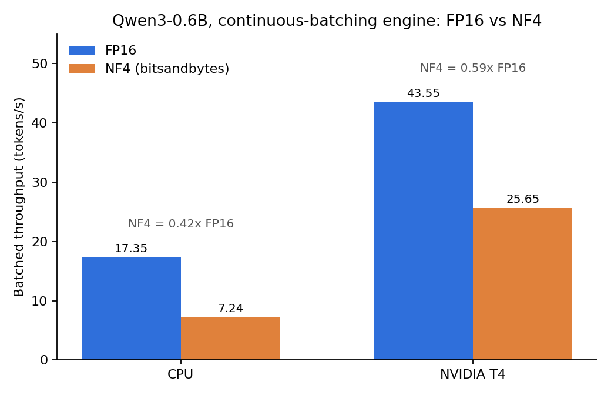

# Toy Continuous-Batching Inference Server

A from-scratch reimplementation of the core scheduling and batching mechanics behind LLM inference servers like vLLM, built to understand *why* they behave the way they do by implementing the pieces and then measuring where they break.

Plain Python + HuggingFace `transformers`, no vLLM code. Model: `Qwen/Qwen3-0.6B`. Measured on CPU and on a single NVIDIA T4.

## Headline results

| Finding | Evidence |
|---|---|
| Continuous batching with real batched decode gives a ~2x system-throughput gain over single-request decoding on both CPU and GPU | CPU 8.08 → 17.35 tok/s, T4 17.41 → 43.55 tok/s (FP16) |
| Scheduling and batching are separable: smarter admission order alone gives **no** throughput gain; the gain comes from merging compute | Stage 3b stays flat at ~9 tok/s, Stage 4 reaches ~16-17 tok/s |
| 4-bit NF4 quantization (bitsandbytes) was a **throughput regression** at this model size, on both CPU and GPU | GPU batched: 43.55 → 25.65 tok/s; CPU batched: 17.35 → 7.24 tok/s |
| Under overload, the server degrades differently from vLLM: it queues silently until clients time out, instead of rejecting based on a token/KV budget | Stage 5 load tests, see below |

## Stages

| Stage | What it adds | Result |
|---|---|---|
| 1. Single request | Hand-written token-by-token loop (no `model.generate()`) | Baseline correctness |
| 2. Sequential queue | Requests served one at a time, KV cache, TTFT/decode/TPS instrumentation | 43.2 s for 8 prompts, ~9.7 tok/s per request |
| 3a. Static batching | All requests padded and batched for the full generation | 27-33 tok/s (~3.4-3.9x over sequential) |
| 3b. Continuous batching (scheduling only) | Dynamic admission/eviction, decode still unbatched | ~9 tok/s, flat: scheduling alone doesn't add throughput |
| 4. Continuous batching (batched decode) | One padded forward pass per step across the active batch, with a `KVCacheManager` for variable-length caches | ~16 tok/s on CPU (below static batching because the batch isn't always full) |
| 5. Serving + load test | Threaded Flask wrapper around the engine, load-tested with [`hey`](https://github.com/rakyll/hey) at c=5/10/20/40 | Engine-bound at ~1 req/s, see below |
| 6. Quantization | FP16 vs NF4 (bitsandbytes) through the same engine, CPU and T4 | Consistent NF4 regression, see below |

## Architecture

- **`Request`**: per-request state (prompt, KV cache, generated tokens, arrival / batch-entry / finish timestamps, finish reason).
- **`RequestQueue`**: FIFO waiting queue.
- **`ActiveBatch`**: the set of in-flight requests decoded together, capped by `MAX_BATCH_SIZE`.
- **`ContinuousBatchEngine`**: the scheduler. Admits requests into free slots, runs one decode step across the active batch, evicts finished requests, repeats until queue and batch are empty.
- **`KVCacheManager`**: builds a shared left-padded `DynamicCache` from requests with different cache lengths and computes the per-row `attention_mask` and `position_ids` for a correct batched forward pass.
- **`server.py`**: Flask wrapper. One background engine thread; each HTTP request blocks on a `threading.Event` until its generation completes. Exposes `/metrics` (queue depth, active batch size).

## Quantization results (Stage 6)

Same engine, same prompts, same hardware, FP16 vs NF4 via bitsandbytes 0.50.2. Throughput in tokens/s.

| Hardware | Precision | Single request | Batched | NF4 / FP16 (batched) |
|---|---|---|---|---|
| CPU | FP16 | 8.08 | 17.35 | |
| CPU | NF4 | 4.33 | 7.24 | 0.42x |
| NVIDIA T4 | FP16 | 17.41 | 43.55 | |
| NVIDIA T4 | NF4 | 11.73 | 25.65 | 0.59x |



NF4 was slower in every configuration, and batched decoding regressed more than single-request decoding.

**Why.** bitsandbytes' 4-bit kernels are designed around matmuls with inner dimension of roughly 4096 or more (7B-class models). Qwen3-0.6B's hidden size is ~1024, well below that, so the dequantize overhead isn't amortized. Its fast fused batch-1 path also historically fell back to a slower unfused path for batch > 1 (fixed for CUDA/ROCm in 0.50.0+, not on CPU). I did not chase a positive quantization result (e.g. AWQ, or a 7B model); the point of the stage was to measure honestly and explain the result.

Benchmarking this stage also exposed two bugs in the engine itself:
1. `decode_active_batch` ran a per-layer KV-cache clone on *every* decode step instead of only when an admission was about to rebuild the batch. This fixed overhead dominated single-request throughput. (It is also why Stage 4's ~16 tok/s differs slightly from the 17.35 tok/s batched FP16 figure above, which was measured after the fix.)
2. `Request.text` relied on an implicit global `tokenizer`, which broke when the benchmark was refactored into functions.

## Load testing and comparison with vLLM (Stage 5)

The server was load-tested with `hey` against localhost at 5, 10, 20, and 40 concurrent clients, with `MAX_BATCH_SIZE=4` and uniform `max_new_tokens`.

- **Throughput is engine-bound (~1 req/s) regardless of client concurrency.** More clients only means a deeper queue.
- **Latency forms discrete bands, not a smooth distribution.** This is coordinated omission from closed-loop clients hitting a fixed batch size with uniform generation lengths. Polling `/metrics` confirmed it at the scheduler level: `queue_depth + active_batch_size` summed to the client count `c` throughout.
- **At c=20 and c=40, failures were client-side timeouts** (hey's default 20 s), not server-side rejections. The server holds every connection open until the full generation finishes (no token streaming) and has no admission cap of its own.

That last point is the key divergence from real vLLM, which I studied in parallel on the same model:

- On a T4 with vLLM, a concurrency sweep (c=10 to 50) showed a TTFT wall between c=40 and c=50, with the GPU handling ~4-5x more concurrency than CPU before degrading.
- Deliberately starving vLLM's KV budget (`--gpu-memory-utilization 0.25 --max-model-len 2048`) produced an admission-queue collapse: P99 TTFT reached ~5.8 s at c=20 while time-per-output-token stayed flat, so the bottleneck was queue admission, not compute.
- I hypothesized preemption-and-readmission as the cause, checked the logs, and found **no preemptions**: 500/500 requests succeeded in a tight ~11.3-12.4 s band. The cause was a hard admission cap from the starved KV block budget, with requests waiting in a FIFO queue for a free slot (traced to the Gate 1 / Gate 2 logic in vLLM's `scheduler.py`).

The toy server reproduces the *queueing* behavior but not the *proactive budget-based admission control* that makes vLLM's overload behavior predictable.

## Other things this project surfaces

- **KV caching matters for correctness of cost, not just speed.** The naive Stage 1 loop recomputes the full sequence every step (O(n²)); `past_key_values` avoids it.
- **Padding needs care.** Left-padding, attention masks, and manually computed `position_ids` are all required. Getting any one wrong produces plausible but wrong output.
- **Batched vs. sequential output is not bit-exact** even when correct. I isolated 3 of 8 diverging prompts to padding-triggered cases and verified the input IDs, mask, and positions by hand; the remaining divergence is attributed to floating-point non-determinism in attention kernels under padding.
- **Merging variable-length KV caches is the hard part.** Two bugs hit here: per-request caches keeping stale left-padding after leaving a batch, and cache lengths derived from the shared tensor's `get_seq_length()` instead of tracked per request. The second made the model attend to zero-padding as real content and produced degenerate repetitive output.
- **Why PagedAttention exists.** `build_batched_cache` rebuilds the full cache on every admit/evict. That is the cost block-based KV management removes. It is deliberately not implemented here.

## Limitations and open items

- Missing spaces between words in some generated text (e.g. "Whatis"), suspected but unverified to correlate with decode steps right after a batch admit/evict.
- No block-based KV cache; the full batch cache is re-padded and re-copied on every membership change.
- No token streaming and no server-side admission control (see Stage 5).
- Small model (0.6B) and uniform synthetic workloads, so conclusions about quantization and batching may not transfer to 7B-class models or realistic request-length distributions.
- Closed-loop load generation (`hey`) understates tail latency; an open-loop generator would be a more faithful test.
- Stage 4 per-step overhead has been reduced, but not re-benchmarked across all earlier stages.

## Running it

```bash
pip install transformers torch bitsandbytes
python run.py  # Runs the engine with given prompt and Max token size
```

`MAX_BATCH_SIZE` controls how many requests can be active at once. For the quantization benchmark, install `bitsandbytes` and run: `<TODO: add benchmark script name and arguments>`.

## Next steps

Block-based KV cache management (PagedAttention-style), an open-loop load generator, and a contribution to a smaller, more readable OSS project such as `guidellm` once the mental model is solid.